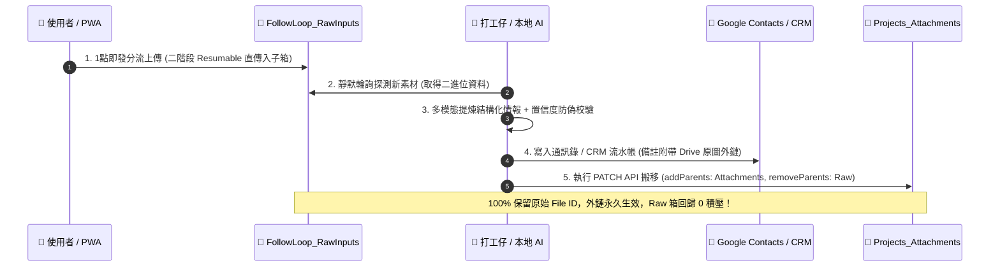

# 🏛️ FollowLoop Web Gate (FollowLoop-Web)
> **企業級商務情報閉環、雙表 CRM 看板與多模態 AI 門閥 (Serverless PWA)**

[](https://report.foxlink.co.in)
[](https://report.foxlink.co.in)
[](#-二架構特性與核心技術棧)
[](#-三核心功能模組全景)

---

## 📌 一、專案概述 (Project Overview)

`FollowLoop-Web` 是 **FollowLoop 閉環工程 AI 助理** 的前端純靜態單頁應用 (SPA & PWA)。雖然它在整體工程中與本地 Python AI 代理人協同運作，但其底層採用 **100% 獨立解耦設計**——**只要配置 Google Apps Script (GAS) 雙網關與 OpenRouter 打工仔模型池，即可作為獨立的商務情報與 CRM 專案總管系統在任何瀏覽器或手機 PWA 中自主運轉！**

本專案完全免除 Node.js 編譯打包環節（0 `npm install`、0 `node_modules` 雜物），純靠現代原生 Web API（ES6 Modules、Vanilla CSS、Service Worker、IndexedDB、Web Share Target API、Fetch API）構建，具備頂級效能、超低延遲與極致流暢的使用者體驗。

---

## ⚡ 二、架構特性與核心技術棧

```text
               【使用者入口 / 多端設備】
  (電腦瀏覽器 Desktop / 手機 PWA 安裝 / Android 系統分享)
                         │
                         ▼
┌────────────────────────────────────────────────────────┐
│               FollowLoop Web Gate (PWA)                │
│  - 0-Token 快捷素材分流 (1 點即發 Click-and-Go)        │
│  - Web Share Target Level 2 (Android 外部檔案分享接收) │
│  - FL_AI_LOGGER 任務狀態機 (即時日誌抽屜透明可查)       │
│  - 雙表 CRM 專案看板 (Projects_Master + Raw)           │
└───────┬────────────────────────┬───────────────────────┘
        │                        │
        ▼ (二階段直傳 & 查詢)      ▼ (打工仔任務分流)
┌──────────────────────┐ ┌──────────────────────────────┐
│  Google Cloud (GAS)  │ │ OpenRouter 免費模型池中央總帳 │
│  - Sheets 資料庫網關 │ │ (Google Sheets 動態探針 SSOT)│
│  - Drive 直傳授權門閥│ │ 550B > 200B > 70B > 31B 秒排 │
│  - Contacts 通訊錄   │ │ 404 自動剔除 / 429 冷卻自癒   │
└──────────────────────┘ └──────────────────────────────┘
```

1. **零編譯依賴 (0-Build Architecture)**：
   - 原生 ES6+ 與模組化結構，任何靜態託管（GitHub Pages、Cloudflare Pages、Vercel、Apache/Nginx）皆可開箱即用。
2. **PWA & 原生系統級整合 (Web Share Target Level 2)**：
   - 支援安裝至手機桌面，離線靜態資源由 `sw.js` 進行 Network-First 快取。
   - 支援 Android 系統層級「分享至 FollowLoop」：無論在 WhatsApp、相簿、語音備忘錄選取檔案，皆可直接分享至本 PWA 中轉處理。
3. **無伺服器雙軌架構 (Serverless Dual-GAS Integration)**：
   - 透過 Google Apps Script 將 Google Sheets 作為高可靠關聯型數據庫。
   - 透過二階段 Resumable Upload 授權直傳 Google Drive，繞過傳統 Server 頻寬與 GAS POST 50MB 檔案限制。
4. **打工仔大模型池彈性調度 (OpenRouter Worker Engine)**：
   - 前端整合雲端中央總帳，支援 Text、Vision、Audio 多模態大模型隊列，具備思考標籤自癒過濾與正則救援機制。

---

## 🎯 三、核心功能模組全景

### 1. ⚡ 素材直傳門閥 (Ingestion Gate)
* **全通路「1 點即發 (Click-and-Go)」分類選單**：
  - 上傳單檔或批次選取時，彈窗提供 6 大實體場景箱（`BusinessCards`, `Vouchers`, `VoiceMemos`, `ChatScreenshots`, `TravelTracks`, `ProjectDocs`）與未分類特權通道。
  - 點擊按鈕瞬間發起直傳（0.2s 延遲，0 Token 浪費），以 100% 絕對真理分流確保 Google Drive 待處理箱毫無積壓或混淆。
* **名片成對關聯上傳**：
  - 批次選取 2 張名片圖片時，自動以 `card_YYYYMMDD_HHMMSS_front` 與 `_back` 成對關聯命名。
* **二階段大檔直傳門閥 (Resumable Upload)**：
  - 大於 25MB 至 200MB+ 的大影音檔自動透過 Drive API 分塊直傳，附帶即時進度條。

### 2. 🤖 後台打工仔模組化巡檢管線 (BackgroundWorkerPipeline)
* **靜默背景巡檢 (Silent Background Polling)**：
  - 網頁開啟後定時（預設 60 秒）掃描 Google Drive 待處理箱。
* **名片全鏈路自動入庫 (BusinessCardHandler)**：
  - 自動下載名片圖檔 ➔ 打工仔 Vision 提煉 7 大欄位 ➔ Google 聯絡人查重與寫入 ➔ 0 拷貝 PATCH 搬移歸檔至 `Projects_Attachments/BusinessCards/`。
* **防幻覺置信度硬門閥 (Confidence Gate)**：
  - 嚴格校驗姓名合法性與聯繫方式（電話/信箱/公司）。若屬模糊或殘缺資訊，強制保留在 Raw 箱並給予 10 分鐘冷卻，杜絕垃圾資料污染通訊錄。
* **狀態互斥防禦**：
  - 提供 `pause()` 與 `resume()` 接口，本機 AI 代理人進行大規模治理時可暫停前端輪詢，避免併發搶工。

### 3. 🤖 人機協同審核關卡 (HITL Review Gate)
* 提供待確認情報卡片看板 (`PENDING_REVIEW`)。
* 支援人類點擊 **[✅ 是 / ✏️ 修改 / ✕ 否]**。審核通過後正式入庫，作廢時後端執行物理抹除（0 垃圾殘留）。

### 4. 💎 雙表 CRM 專案看板 (Live View & Project Manager)
* **雙表 1-to-N 關聯聚合**：
  - `Projects_Master` (21 欄 CRM 專案主檔) ✕ `Memory_Pool_Raw` (11 欄時間軸流水帳) ✕ `Projects_Attachments` (6 欄專案正式附件)。
* **四級行動優先權矩陣**：
  - 🟢 主動進行 / 高優先權 (`HIGH`)
  - 🟠 被動進行 / 低優先權 (`LOW`)
  - 🔴 暫停行動 (`PAUSED`)
  - ⚪ 待完善 / 未分類新專案 (`UNCLASSIFIED`)
* **全生命週期專案管理 (CRM CRUD)**：
  - 涵蓋 12 大官方字典階段（`Lead` ➔ `RFQ` ➔ `Qualification` ➔ `Award` ➔ `SOP/MP`）。
  - 響應式雙欄/分頁詳情抽屜，支援動態時間軸即時追加與附件外鏈管理。

---

## 🗄️ 四、雲端數據資產：Google Drive 雙箱鏡像架構 (Google Drive Architecture & Lifecycle)

FollowLoop 前端與 Google Drive 的互動恪守 **「待處理 0 積壓」** 與 **「8 大物理場景契約鏡像」** 兩大最高原則。前端 Web 與後台打工仔將 Google Drive 視為分散式物件資料庫：

### 1. 雙箱鏡像目錄樹狀結構 (Dual-Box Directory SSOT)

```text
Google Drive 根目錄
├── 📁 FollowLoop_RawInputs/                    <-- 【待處理門閥箱】(0 積壓目標)
│   ├── 📁 BusinessCards/                       <-- 🪪 待處理名片 (前綴 card_)
│   ├── 📁 Vouchers/                            <-- 🧾 待處理發票/單據 (前綴 voucher_)
│   ├── 📁 VoiceMemos/                          <-- 🎙️ 待提煉語音 (前綴 audio_)
│   ├── 📁 ChatScreenshots/                     <-- 💬 待處理截圖 (前綴 chat_)
│   ├── 📁 TravelTracks/                        <-- 📍 待處理出差佐證 (前綴 track_)
│   ├── 📁 ProjectDocs/                         <-- 📄 待處理專案文檔 (前綴 doc_)
│   ├── 📁 Links/                               <-- 🌐 待處理網址 (前綴 link_)
│   └── 📁 Unclassified/                        <-- 📦 未分類 (0 LLM 直傳)
│
└── 📁 Projects_Attachments/                   <-- 【正式資產總庫】(ID: 1qSx-L6u6thXV_JY5oLu5gXg_58hVRAnX)
    ├── 📁 BusinessCards/                      <-- 🪪 已處理名片 (與 Google 聯絡人備註綁定)
    ├── 📁 Vouchers/                           <-- 🧾 已處理報銷發票 (與週報/出差單綁定)
    ├── 📁 VoiceMemos/                         <-- 🎙️ 已提煉語音原檔 (與流水帳綁定)
    ├── 📁 ChatScreenshots/                    <-- 💬 已解析對話截圖
    ├── 📁 ProjectDocs/                        <-- 📄 正式專案規格與文檔
    └── 📁 Projects/                           <-- 依專案 Tag 分流之正式資產 (如 Item_02_VVDN/)
```

### 2. 8 大物理場景契約字典 (RAW_SCENE_CATEGORIES SSOT)

前端 [`js/config.js`](js/config.js) 與本機 CLI [`drive_ops.py`](../.agents/skills/google_drive_operator/scripts/drive_ops.py) 100% 同步共用以下場景契約：

| 場景鍵值 (Key) | 子資料夾 (Folder) | 檔名前綴 (Prefix) | 圖示 | 業務場景與分流說明 |
| :--- | :--- | :--- | :---: | :--- |
| `BUSINESS_CARDS` | `BusinessCards` | `card` | 🪪 | 名片正反面（批次選 2 張自動以 `front`/`back` 成對關聯） |
| `VOUCHERS` | `Vouchers` | `voucher` | 🧾 | 出差發票、計程車收據、機票行程單、印度 UPI 支付截圖 |
| `VOICE_MEMOS` | `VoiceMemos` | `audio` | 🎙️ | 出差口述隨筆、會議錄音、客戶談判現場錄音檔 |
| `CHAT_SCREENSHOTS` | `ChatScreenshots` | `chat` | 💬 | 微信/WhatsApp 重大商務動態、交期與規格承諾截圖 |
| `TRAVEL_TRACKS` | `TravelTracks` | `track` | 📍 | Google 地圖導航截圖、工廠外觀、客戶合影出差佐證 |
| `PROJECT_DOCS` | `ProjectDocs` | `doc` | 📄 | 客戶規格書 (Drawing/BOM)、正式 RFQ、報價單、合約 PPT |
| `LINKS` | `Links` | `link` | 🌐 | 產業新聞、競品網址、客戶官方通告連結 |
| `UNCLASSIFIED` | `Unclassified` | `raw` | 📦 | 未分類通道（緊急上傳、0 LLM 快速直傳） |

### 3. 素材生命週期與 0 拷貝 PATCH 搬移律 (Zero-Copy Move Law)



* **安全不變量**：所有歸檔搬移操作均調用 Google Drive REST API 的 `PATCH` 方法更新 `parents` 陣列，**絕不重新下載上傳**，100% 保留原檔之 `file_id`，確保在 Google 聯絡人名片備註、週報附件、或 CRM 資料表中的原圖檢視 URL 永久有效！

---

## 📁 五、目錄結構 (Directory Tree)

```text
FollowLoop-Web/
├── index.html                     # 生產環境正式單頁 SPA
├── FollowLoop-web-V4.8.html       # 最新版本化隔離驗收頁面 (遵守隔離開發天條)
├── manifest.json                  # PWA Manifest (配置 Web Share Target Level 2)
├── sw.js                          # Service Worker (Network-First 快取與分享攔截)
├── CNAME                          # GitHub Pages 自訂網域名稱 (report.foxlink.co.in)
│
├── css/                           # 純原生 CSS 樣式庫 (無 Tailwind / 零構建)
│   ├── main.css                   # 全域排版、字型與基礎重設
│   ├── components.css             # 模組化元件樣式 (卡片、按鈕、彈窗、進度條)
│   ├── responsive.css             # 行動裝置與平板自適應斷點
│   └── themes.css                 # 多配色主題 (Midnight, Dark Slate, Cyberpunk 等)
│
├── js/                            # 核心 ES6 JavaScript 模組庫
│   ├── config.js                  # 全域中央配置 (GAS URLs, 8大場景字典, OpenRouter密鑰)
│   ├── app.js                     # 應用主程式控制器 (分頁切換、上傳、分享中轉)
│   ├── background-pipeline.js     # 後台打工仔巡檢引擎 (名片自動化與防幻覺門閥)
│   ├── openrouter-worker.js       # 打工仔模型呼叫客戶端 (雙模回傳契約、思考標籤過濾)
│   ├── openrouter_extractor.js    # 多模態結構化資訊提煉器 (Vision/Audio Prompt Schema)
│   ├── drive_uploader.js          # Google Drive 二階段大檔直傳封裝
│   ├── hitl_reviewer.js           # 人機審核關卡控制器
│   ├── live_view.js               # 雙表 CRM 看板與時間軸聚合引擎
│   ├── project_manager.js         # 21 欄專案主檔 CRUD 控制器
│   └── auth.js                    # 身分驗證與 Session 管理
│
└── img/                           # 靜態圖標與品牌識別資源
    ├── icons/                     # PWA 應用程式多尺寸圖示
    ├── wlogo_foxlink_s.png        # 深色主題 Logo
    └── deepbluelogo_foxlink-m.png # 淺色主題 Logo
```

---

## 🚀 六、獨立運行與配置指南 (Standalone Setup)

### 1. 本地快速預覽
由於是純靜態架構，無需安裝 Node.js，您只需在 `FollowLoop-Web` 目錄下啟動任何 HTTP 伺服器：

```bash
# 使用 Python 內建伺服器
cd FollowLoop-Web
python -m http.server 8080

# 或使用 Node 的 serve / http-server
npx serve .
```
瀏覽器開啟 `http://localhost:8080` 即可使用。

### 2. 獨立配置中央參數 (`js/config.js`)
若需要將前端部署至新的雲端或獨立試算表，僅需修改 `js/config.js` 中的常數：

```javascript
const CONFIG = {
  // 1. Google Sheets 數據庫網關 (Universal_GAS_Gateway)
  GAS_WEB_APP_URL: "https://script.google.com/macros/s/AKfycbw8.../exec",
  
  // 2. Google Drive 二階段直傳門閥
  GAS_DRIVE_URL: "https://script.google.com/macros/s/AKfycbyw.../exec",
  
  // 3. Google Contacts 聯絡人網關
  CONTACTS_GATEWAY_URL: "https://script.google.com/macros/s/AKfycbyK.../exec",
  
  // 4. 線上試算表 ID
  SPREADSHEET_ID: "YOUR_SPREADSHEET_ID",
  
  // 5. Google Drive 資料夾 ID
  DRIVE_RAW_INPUTS_FOLDER_NAME: "FollowLoop_RawInputs",
  DRIVE_ATTACHMENTS_FOLDER_ID: "1qSx-L6u6thXV_JY5oLu5gXg_58hVRAnX",
  DRIVE_ATTACHMENTS_FOLDER_NAME: "Projects_Attachments"
};
```

---

## 🔒 七、不可違背之工程天條 (Invariants)

1. **Web 隔離開發天條 (Isolated Development Rule)**：
   - 嚴禁直接在開發過程中修改 `index.html`。
   - 所有 UI 與邏輯改動必須建立版本化副本（如 `FollowLoop-web-V4.8.html`），經使用者本地雙擊驗收通過後，才正式覆蓋發布至 `index.html`。
2. **數據庫 SSOT 零觸碰防線**：
   - `Memory_Pool_Raw` 鎖死 11 欄 SSOT (嚴禁追加 Priority 欄位)；`Memory_Pool_View` B~E 欄零碰觸。
3. **未授權禁止 Git 推送**：
   - 未經使用者明確指示，嚴禁執行 `git push` 或私自發布至遠端倉庫。

---

## 📄 八、授權條款 (License)

Copyright © 2026 Foxlink India. All rights reserved.  
專供內部商務情報追蹤與 CRM 專案管理系統使用。
